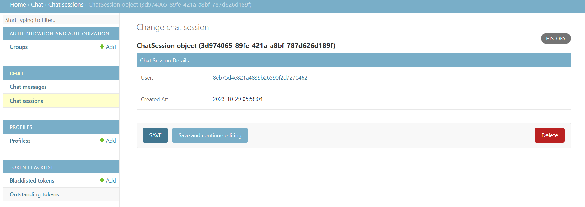
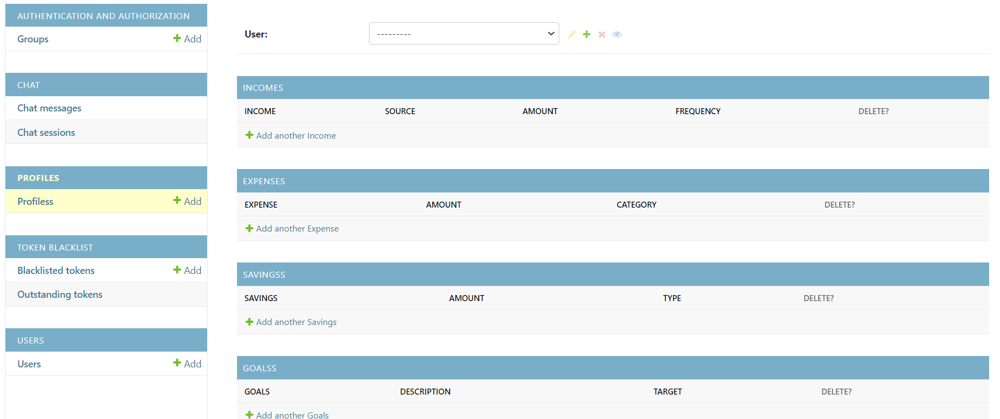

# A2svHackathon

## Description

A2svHackathon is an AI financial literacy platform designed to facilitate learning about financial literacy and entrepreneurship.

## Backend

### Technologies

The project is created with:

- Python Django
- Django RestFramework
- drf_yasg (swagger) -- for endpoint documentation

### Installation

1. **Prerequisites:**
   - Make sure Python 3.8.10 is installed.

     ```bash
     python --version  # Should be Python 3.8.10
     ```

2. **Clone the Repository:**
   - Using SSH:

     ```bash
     git clone git@github.com:EdwinAtieno/A2svHackathon.git
     ```

   - Using HTTP:

     ```bash
     git clone https://github.com/EdwinAtieno/A2svHackathon.git
     ```

   - Navigate to the cloned folder:

     ```bash
     cd A2svHackathon
     ```

3. **Install Requirements:**
   ```bash
   make requirements  # or python3 manage.py install -r requirements.txt || pipenv install --dev
   ```


### Environment Variables

| Variable         | Description                                                                                                                      | Default          |
| ---------------- | -------------------------------------------------------------------------------------------------------------------------------- | ---------------- |
| **SECRET_KEY**   | **Required** - String of random characters used for cryptographic signing in [Django](https://docs.djangoproject.com/en/2.1/ref/settings/#std:setting-SECRET_KEY) projects.                  | -                |
| **DB_NAME**      | **Required** - Represents the name of the database.                                                                               | -                |
| **ENVIRONMENT**  | *Optional* - Used to load different settings based on the environment selected. Choices: `production`, `development`, `common`.  | `development`    |
| **DB_USER**      | **Required** - Represents the database username.                                                                                 | -                |
| **DB_PASSWORD**  | **Required** - Database password.                                                                                                | -                |
| **DB_HOST**      | **Required** - Database host.                                                                                                   | -                |


### Usage

- Clone the repository:
  - Using SSH:

     ```bash
     cd A2svHackathon
     ```

  - Using Http:

    ```tet
    git clone https://github.com/EdwinAtieno/A2svHackathon.git
    ```

- Navigate to the cloned folder:

     ```bash
     cd A2svHackathon
     ```

-   Pre-commit hook

     ```bash
     pre-commit install
     ```

- Create a virtual environment.

     ```bash
     python3 -m venv venv

     Or Install virtualenv then
     virtualenv venv

     On Linux ~ source venv/bin/activate

     On windows ~ venv\Scripts\Activate

     Or run pipenv shell
    ```

- Configuring postgres Ubuntu

    ```bash
    Update: sudo apt update
    
    Installing: sudo apt install python3-pip python3-dev libpq-dev postgresql postgresql-contrib
    
    First login by running: sudo -u postgres psql
    
    Create DB: CREATE DATABASE A2svHackathon;
    
    Create USER: CREATE USER A2svHackathon WITH PASSWORD 'A2svHackathon@';
    
    run: \q to exit server
    ``` 

- Run migrations.

     ```bash
     make migrations ~ python manage.py makemigrations

     make migrate ~ python manage.py migrate
     ```

- Create a super user.

     ```bash
     python manage.py createsuperuser
     ```

- Run the app.

     ```bash
     make serve ~ python manage.py runserver
     ```

- This opens the app at {{BASE_URL}}

     ```bash
     localhost:8000
     ```

- or

     ```bash
     http://127.0.0.1:8000/

     ```

## Implemented Endpoints

- **Authentication:**
  - Sign-in: [POST] [http://localhost:8000/api/sign-in/](http://localhost:8000/api/sign-in/)

- **User Management:**
  - List of Users: [GET] [http://127.0.0.1:8000/api/users/](http://127.0.0.1:8000/api/users/)

- **Chat Service:**
  - Prompting: [POST] [http://127.0.0.1:8000/api/chat-messages/](http://127.0.0.1:8000/api/chat-messages/)
    - **Sample Request:**
      ```json
      {
        "user_message": "I'm looking to invest some money, but I'm unsure about the best options. Can you provide advice on investment strategies and potential opportunities for good returns?",
        "conversation_history": []
      }
      ```
    - **Sample Response:**
      ```json
      {
        "id": "867e14ff-ccde-4c66-a278-b5b3dcfeac64",
        "timestamp": "2023-10-29T10:02:20.008047+03:00",
        "user_message": "I'm looking to invest some money, but I'm unsure about the best options. Can you provide advice on investment strategies and potential opportunities for good returns?",
        "model_response": "Certainly! Investing is a great way to grow your wealth over time. Before diving into specific investment options, it's important to consider your financial goals, risk tolerance, and investment timeframe.\n\nHere are some investment strategies and potential opportunities for good returns in Kenya:\n\n1. Stock Market: Investing in stocks can provide attractive returns over the long term. Consider investing in well-established companies with a track record of consistent growth and strong fundamentals. It's advisable to diversify your investment across different sectors to minimize risk.\n\n2. Mutual Funds: Mutual funds pool money from multiple investors to invest in a diversified portfolio of stocks, bonds, or other assets. They are managed by professionals and offer a relatively low-cost way to access a diversified investment portfolio.\n\n3. Real Estate: Investing in real estate can be a lucrative long-term investment option. Consider investing in residential or commercial properties, land, or real estate investment trusts (REITs). Rental income and property appreciation can provide good returns.\n\n4. Government Bonds: Government bonds are considered low-risk investments as they are backed by the government. They offer fixed interest payments over a specified period of time and can be a good option for conservative investors.\n\n5. Peer-to-Peer Lending: This involves lending money directly to individuals or small businesses through online platforms. It offers potentially higher returns compared to traditional savings accounts, but it's important to assess the creditworthiness of borrowers and diversify your lending across multiple borrowers.\n\n6. Unit Trusts: Similar to mutual funds, unit trusts pool money from multiple investors to invest in a diversified portfolio of assets. They are managed by professional fund managers and offer a range of investment options based on your risk appetite and investment goals.\n\nRemember, it's crucial to conduct thorough research, seek advice from financial professionals, and diversify your investments to manage risk effectively. Additionally, regularly review and rebalance your portfolio to ensure it aligns with your changing financial goals and market conditions.\n\nPlease note that investment returns are subject to market fluctuations, and past performance is not indicative of future results. It's essential to consider your personal financial situation and consult with a financial advisor before making any investment decisions.",
        "role": "user",
        "user": "8eb75d4e821a4839b26590f2d7270462",
        "session": "3d974065-89fe-421a-a8bf-787d626d189f"
      }
      ```

- **Sessions:**
  - Create Session: [POST] [http://127.0.0.1:8000/api/chat-sessions/](http://127.0.0.1:8000/api/chat-sessions/)

- **Profile Management:**
  - Profile List: [GET] [http://localhost:8000/api/profile/](http://localhost:8000/api/profile/)
  - Profile Detail: [GET] [http://localhost:8000/api/profile/<profile_id>/](http://localhost:8000/api/profile/<profile_id>/)

- **Financial Data:**
  - Income List: [GET] [http://localhost:8000/api/income/](http://localhost:8000/api/income/)
  - Income Detail: [GET] [http://localhost:8000/api/income/<income_id>/](http://localhost:8000/api/income/<income_id>/)
  - Expense List: [GET] [http://localhost:8000/api/expense/](http://localhost:8000/api/expense/)
  - Expense Detail: [GET] [http://localhost:8000/api/expense/<expense_id>/](http://localhost:8000/api/expense/<expense_id>/)
  - Savings List: [GET] [http://localhost:8000/api/savings/](http://localhost:8000/api/savings/)
  - Savings Detail: [GET] [http://localhost:8000/api/savings/<savings_id>/](http://localhost:8000/api/savings/<savings_id>/)
  - Goals List: [GET] [http://localhost:8000/api/goals/](http://localhost:8000/api/goals/)
  - Goals Detail: [GET] [http://localhost:8000/api/goals/<goals_id>/](http://localhost:8000/api/goals/<goals_id>/)

------

- Detailed View:
  - http://127.0.0.1:8000/docs/swagger/ 


### Admin Section
- Persisted Chats


- User Sessions


- User Profile Information
 

**_DEVELOPERS_**
- Team Octatech